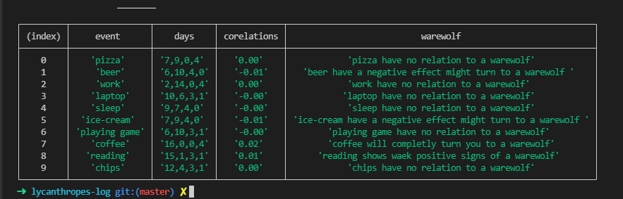
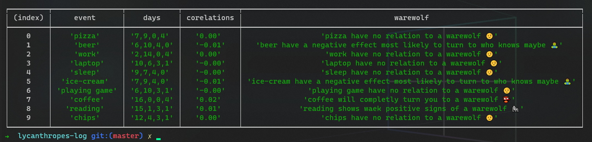

# Lycanthrope's Log Console app
## Task

### Scenario: A Lycanthrope's log

### [Demo](https://replit.com/@izaakwalz/Lycanthropes-log-console-app?v=1)

Build a console app that records the events of a warewolf.
You will end up using this log to determine the activites
that make the warewolf turn.

## Achived

was able to do this using the example in <b>Eloquent JavaScript</b> chp 4.

## Preview

---
<b>👾👾👾👾👾👾👾👾👾👾👾👾👾👾👾👾👾👾👾_________👾👾👾👾👾👾👾👾👾👾👾👾👾👾👾👾👾👾👾👾👾👾</b>

